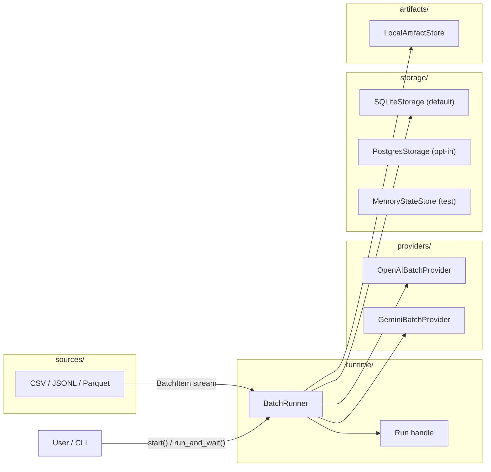
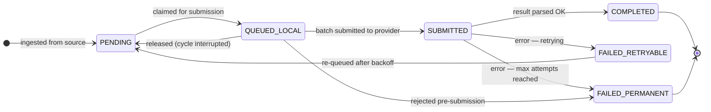

# batchor

`batchor` grew out of a recurring problem in academic research: running large datasets through LLMs in batch — reliably, reproducibly, and without reinventing the same glue code across every project. The patterns that kept emerging (durable state, typed results, safe resume after failure) were extracted into this library so they do not have to be rebuilt each time.

`batchor` is a durable provider Batch runner for Python teams that want:

- typed Pydantic results
- resumable durable runs
- replayable request artifacts
- deterministic source checkpoints
- provider-side enqueue limit controls to stay within token budgets
- library-first run controls
- a small operator CLI for CSV and JSONL jobs

It is intentionally narrow today: OpenAI is the CLI default, Gemini is opt-in through `batchor[gemini]`, SQLite is the CLI durability backend, and the Python API exposes the broadest configuration surface.

## What problem it solves

Most OpenAI Batch examples stop at "upload a JSONL file and poll until it finishes." Real workloads usually need more than that:

- durable state so a process restart does not lose the run
- typed result parsing for structured outputs
- artifact retention so submitted requests can be replayed or audited
- clear export and prune steps once a run is done
- stable source checkpoints before request artifacts exist
- a stable run handle that can be rehydrated later

`batchor` packages those concerns behind a small public surface:

- `BatchItem` describes one logical item of work.
- `BatchJob` describes how to turn items into provider requests.
- `BatchRunner` owns durable execution.
- `Run` is the durable handle you refresh, wait on, inspect, export, and prune.

## Current scope

Built-in implementations:

- `OpenAIProviderConfig` + `OpenAIBatchProvider`
- `GeminiProviderConfig` + `GeminiBatchProvider` for text-only Gemini Batch jobs
- `SQLiteStorage`
- `PostgresStorage` as an opt-in durable control-plane backend
- `MemoryStateStore`
- `LocalArtifactStore`
- `CompositeItemSource`
- `CsvItemSource`
- `JsonlItemSource`
- `ParquetItemSource`

Important constraints:

- the Python API is broader than the CLI
- the CLI supports file-backed inputs only
- users still own selecting and ordering input files or partitions
- the built-in CLI uses SQLite durability only
- the CLI supports OpenAI plus Gemini Developer API and Vertex AI text jobs
- Gemini support is text-only for now and does not build multimodal requests
- structured-output rehydration requires an importable module-level Pydantic model
- raw output artifacts are retained by default and must be exported before raw pruning
- pause/resume/cancel and incremental terminal-result APIs are library-first today
- OpenAI control-plane or batch-level 429 quota/billing exhaustion auto-pauses the run instead of burning attempts across the remaining backlog

## Mental model

The normal lifecycle is:

1. Build a `BatchJob` with items, prompt-building logic, and provider config.
2. Call `BatchRunner.start(...)` to create or resume a durable run.
3. Keep the returned `Run` handle and call `refresh()` or `wait()`.
4. Read `summary()`, `snapshot()`, or terminal `results()`.
5. Optionally pause, resume, cancel, or consume terminal results incrementally.
6. When the run is finished, optionally `export_artifacts(...)`.
7. When retention requirements are satisfied, `prune_artifacts(...)`.

Durability is split on purpose:

- storage tracks run state, item state, attempts, batches, checkpoints, and artifact pointers
- the artifact store keeps replayable request JSONL and downloaded raw batch payloads

That split is what allows retries and fresh-process resume without keeping every request inline in the control-plane store.
On resume, existing active provider batches are polled before `batchor` materializes or submits new local work, so completed batches and retry backoff are reconciled first. Deterministic sources also use stored checkpoint completion metadata to avoid opening a fully materialized Parquet or composite source just to discover there are no rows left.

## Architecture



For the detailed execution diagrams and module-boundary narrative, see
[`docs/design_docs/ARCHITECTURE.md`](docs/design_docs/ARCHITECTURE.md).

### Item lifecycle



Operational semantics for resume, run control, and artifact retention live in
[`docs/design_docs/STORAGE_AND_RUNS.md`](docs/design_docs/STORAGE_AND_RUNS.md).

## Install

```bash
pip install batchor
```

For Gemini Batch support, install the optional extra:

```bash
pip install "batchor[gemini]"
```

## Agent setup

Batchor keeps contributor tooling separate from the tools intended for researchers and downstream projects:

- `plugins/batchor/` is the user-facing Codex plugin. Its `$use-batchor` skill and MCP helpers turn datasets and prompts into safe CLI or Python workflows without assuming a Batchor source checkout.
- `.agents/skills/batchor-dev/` and `plugins/batchor-agent-tools/` are contributor-only. They teach agents how to change this repository, find design docs, and run its validation suite.
- `.agents/plugins/marketplace.json` registers both plugins for local development.
- `.vscode/mcp.json` configures the contributor MCP for this workspace.

The PyPI package remains the runtime dependency: `pip install batchor` installs the library and CLI. Agent skills and MCP configuration are distributed as the separate `batchor` plugin so Python environments do not receive Codex-specific files implicitly.

To try the user plugin from a local checkout:

```bash
codex plugin marketplace add /path/to/batchor
codex plugin add batchor@batchor-local
```

Start a new Codex task after installation, then ask: `Use $use-batchor to turn my CSV and research prompt into a resumable batch job.`

Supported Python versions:

- `3.12`
- `3.13`
- `3.14`

## Authentication

For Python API usage, auth resolution is:

1. explicit provider config credentials such as `OpenAIProviderConfig(api_key=...)` or `GeminiProviderConfig(api_key=...)`
2. ambient provider environment variables, currently `OPENAI_API_KEY` or `GEMINI_API_KEY`
3. Vertex AI Application Default Credentials when `GeminiProviderConfig(vertexai=True, ...)` or `GOOGLE_GENAI_USE_VERTEXAI=true` is used

The Python library does not auto-load `.env`.

The CLI loads a local `.env` as a convenience for interactive/operator usage.

## Python quickstart

### Text job

```python
from batchor import BatchItem, BatchJob, BatchRunner, OpenAIProviderConfig, PromptParts


runner = BatchRunner(storage="memory")
run = runner.run_and_wait(
    BatchJob(
        items=[BatchItem(item_id="row1", payload="Summarize this text")],
        build_prompt=lambda item: PromptParts(prompt=item.payload),
        provider_config=OpenAIProviderConfig(
            model="gpt-4.1",
            api_key="YOUR_OPENAI_API_KEY",
        ),
    )
)

print(run.results()[0].output_text)
```

### Gemini text job

```python
from batchor import BatchItem, BatchJob, BatchRunner, GeminiProviderConfig, PromptParts


runner = BatchRunner(storage="memory")
run = runner.run_and_wait(
    BatchJob(
        items=[BatchItem(item_id="row1", payload="Summarize this text")],
        build_prompt=lambda item: PromptParts(prompt=item.payload),
        provider_config=GeminiProviderConfig(
            model="gemini-2.5-flash",
            api_key="YOUR_GEMINI_API_KEY",
        ),
    )
)

print(run.results()[0].output_text)
```

Gemini support currently builds text-only `GenerateContent` batch requests. It uses Gemini JSONL `key` values internally while keeping `batchor`'s durable item and attempt tracking unchanged.

For Vertex AI, provide a Cloud Storage staging prefix and use Application Default Credentials:

```python
provider_config = GeminiProviderConfig(
    model="gemini-2.5-flash",
    vertexai=True,
    project="my-project",
    location="europe-west8",
    gcs_uri="gs://my-bucket/batchor",
)
```

Vertex AI stages JSONL input and output in that prefix. The Gemini Developer API uses inline requests for batches below 20 MB and the Files API for larger batches; `input_mode=` can override that automatic choice. Vertex request/output correlation uses a generated request label because Vertex output does not include the Developer API JSONL `key`.

### Structured output

```python
from pydantic import BaseModel

from batchor import (
    BatchItem,
    BatchJob,
    BatchRunner,
    OpenAIEnqueueLimitConfig,
    OpenAIProviderConfig,
    PromptParts,
)


class ClassificationResult(BaseModel):
    label: str
    score: float


runner = BatchRunner()
run = runner.start(
    BatchJob(
        items=[BatchItem(item_id="row1", payload={"text": "classify this"})],
        build_prompt=lambda item: PromptParts(prompt=item.payload["text"]),
        structured_output=ClassificationResult,
        provider_config=OpenAIProviderConfig(
            model="gpt-4.1",
            api_key="YOUR_OPENAI_API_KEY",
            enqueue_limits=OpenAIEnqueueLimitConfig(
                enqueued_token_limit=2_000_000,
                target_ratio=0.7,
                headroom=50_000,
                max_batch_enqueued_tokens=500_000,
            ),
        ),
    )
)

run.wait()
print(run.results()[0].output)
```

While waiting, `batchor` polls active batches before submitting more work. If a refresh consumes a completed batch, records terminal item state, or submits another provider batch, `Run.wait()` immediately continues draining instead of sleeping for the next poll interval.

Structured-output models are validated up front against the OpenAI strict-schema subset used by `batchor`.

- root schema must be an object
- object schemas must be closed with `additionalProperties: false`
- object properties must all be listed in `required`

If you need a field to be optional in Python, model it as nullable in the schema shape OpenAI accepts rather than relying on omitted required fields.

The same `structured_output=` API is available with `GeminiProviderConfig`; batchor sends the schema through Gemini `generation_config.response_json_schema` and validates the returned JSON text with the same Pydantic model.

### Rehydrate a durable run

```python
from batchor import BatchRunner, SQLiteStorage


storage = SQLiteStorage(name="default")
runner = BatchRunner(storage=storage)

run = runner.get_run("batchor_20260329T120000Z_ab12cd34")
print(run.summary())
```

### Deterministic sources

```python
from batchor import BatchJob, BatchRunner, JsonlItemSource, OpenAIProviderConfig, PromptParts


source = JsonlItemSource(
    "input/items.jsonl",
    item_id_from_row=lambda row: str(row["id"]) if isinstance(row, dict) else "",
    payload_from_row=lambda row: {"text": row["text"]} if isinstance(row, dict) else {},
)

runner = BatchRunner()
run = runner.start(
    BatchJob(
        items=source,
        build_prompt=lambda item: PromptParts(prompt=item.payload["text"]),
        provider_config=OpenAIProviderConfig(model="gpt-4.1"),
    ),
    run_id="customer_export_20260403",
)
```

If the source file and job config still match the persisted checkpoint, calling `start(job, run_id=...)` again resumes ingestion from the last durable source position instead of duplicating already-materialized items.

To combine multiple deterministic sources into one logical run, wrap them explicitly in `CompositeItemSource`:

```python
from batchor import (
    BatchJob,
    BatchRunner,
    CompositeItemSource,
    CsvItemSource,
    JsonlItemSource,
    OpenAIProviderConfig,
    PromptParts,
)


source = CompositeItemSource(
    [
        CsvItemSource(
            "input/items-a.csv",
            item_id_from_row=lambda row: row["id"],
            payload_from_row=lambda row: {"text": row["text"]},
        ),
        JsonlItemSource(
            "input/items-b.jsonl",
            item_id_from_row=lambda row: str(row["id"]) if isinstance(row, dict) else "",
            payload_from_row=lambda row: {"text": row["text"]} if isinstance(row, dict) else {},
        ),
    ]
)

runner = BatchRunner()
run = runner.start(
    BatchJob(
        items=source,
        build_prompt=lambda item: PromptParts(prompt=item.payload["text"]),
        provider_config=OpenAIProviderConfig(model="gpt-4.1"),
    ),
    run_id="customer_export_20260403",
)
```

`CompositeItemSource` keeps one logical ingest checkpoint for the run while auto-namespacing each child source's `item_id`, so duplicate row IDs across files can coexist.
The original per-source row ID remains available under `metadata["batchor_lineage"]["source_primary_key"]`, and the composite namespace is recorded under `metadata["batchor_lineage"]["source_namespace"]`.
Input ordering is part of resume compatibility.

### Parquet input sources

```python
from batchor import BatchJob, BatchRunner, OpenAIProviderConfig, ParquetItemSource, PromptParts


source = ParquetItemSource(
    "input/items.parquet",
    item_id_from_row=lambda row: str(row["id"]),
    payload_from_row=lambda row: {"text": str(row["text"])},
    columns=["id", "text"],
)

runner = BatchRunner()
run = runner.start(
    BatchJob(
        items=source,
        build_prompt=lambda item: PromptParts(prompt=item.payload["text"]),
        provider_config=OpenAIProviderConfig(model="gpt-4.1"),
    ),
    run_id="customer_export_20260403",
)
```

Parquet support is library-only today and follows the same durable checkpoint rule as CSV and JSONL: resume requires the same `run_id`, the same job config, and the same source identity/fingerprint.
Custom deterministic sources can implement `CheckpointedItemSource`, and `CompositeItemSource` can wrap those adapters too.
Arbitrary generators and live DB cursors are still out of scope unless they can provide a durable resume checkpoint.

### Run control and incremental terminal results

```python
from batchor import BatchRunner, RunControlState, SQLiteStorage


runner = BatchRunner(storage=SQLiteStorage(name="default"))
run = runner.get_run("batchor_20260403T120000Z_ab12cd34")

run.pause()
assert run.summary().control_state is RunControlState.PAUSED

run.resume()
page = run.read_terminal_results(after_sequence=0, limit=100)
export = run.export_terminal_results(
    "exports/partial-results.jsonl",
    after_sequence=0,
    append=False,
    limit=100,
)
print(page.next_after_sequence, export.exported_count)

run.cancel()
```

Run control and incremental terminal-result APIs are Python-first in this release. The CLI does not yet expose `pause`, `resume`, `cancel`, or incremental terminal-result export commands.

OpenAI insufficient-quota failures during upload/create/polling, or as a batch-level terminal error, are treated as an automatic pause with `summary().control_reason == "openai_insufficient_quota"`. Row-level insufficient-quota records inside a completed batch output stay item-scoped: those rows become retryable without consuming attempts, emit `openai_insufficient_quota` failure telemetry, and use retry backoff before resubmission. Auto-pause does not replace an in-progress cancellation.

## CLI quickstart

The CLI is intentionally narrower than the Python API:

- file-backed inputs only
- CSV and JSONL only
- SQLite-backed durable runs only

OpenAI remains the default provider. For Gemini, install `batchor[gemini]` and select the backend explicitly or let `auto` follow `GOOGLE_GENAI_USE_VERTEXAI`:

```bash
batchor start \
  --input input/items.jsonl \
  --id-field id \
  --prompt-field text \
  --provider gemini \
  --model gemini-2.5-flash \
  --gemini-backend developer
```

Vertex AI additionally needs a writable staging prefix:

```bash
batchor start \
  --input input/items.jsonl \
  --id-field id \
  --prompt-field text \
  --provider gemini \
  --model gemini-2.5-flash \
  --gemini-backend vertex \
  --gcs-uri gs://my-bucket/batchor
```

Start a run from JSONL:

```bash
batchor start \
  --input input/items.jsonl \
  --id-field id \
  --prompt-field text \
  --model gpt-4.1
```

`--input` is repeatable. When you pass multiple files, the CLI composes them into one deterministic source in the order given:

```bash
batchor start \
  --input input/items-a.csv \
  --input input/items-b.jsonl \
  --id-field id \
  --prompt-field text \
  --model gpt-4.1
```

For repeated `--input`, the CLI keeps one durable run and one logical source checkpoint.
Result `item_id` values are auto-namespaced per input source so duplicate row IDs across files do not collide, while the original row ID remains under `metadata.batchor_lineage.source_primary_key`.
Changing the `--input` order changes the logical source identity and breaks resume compatibility for the same `run_id`.

Inspect and operate on the durable run:

```bash
batchor status --run-id batchor_20260403T120000Z_ab12cd34
batchor wait --run-id batchor_20260403T120000Z_ab12cd34
batchor results --run-id batchor_20260403T120000Z_ab12cd34 --output results.jsonl
batchor export-artifacts --run-id batchor_20260403T120000Z_ab12cd34 --destination-dir exports
batchor prune-artifacts --run-id batchor_20260403T120000Z_ab12cd34
```

The CLI prints JSON summaries by default.

## Observability

`BatchRunner` accepts an optional observer callback for coarse lifecycle telemetry:

```python
from batchor import BatchRunner, RunEvent


def observer(event: RunEvent) -> None:
    print(event.event_type, event.run_id, event.data)


runner = BatchRunner(observer=observer)
```

Current events include run creation/resume, automatic quota pause, item ingestion, batch submission/polling/completion, item completion/failure, and artifact export/prune.

## Storage notes

- SQLite remains the default durable backend.
- `PostgresStorage` is available for shared control-plane state, but the CLI remains SQLite-only today. Plain `postgresql://` and `postgres://` DSNs are normalized to the package's psycopg v3 driver URL.
- Item `attempt_count` means consumed provider attempts: successful submitted completions increment it, counted item-level failures increment it, and local or batch-level retry/reset paths that did not consume an item attempt leave it unchanged.
- Durable artifacts now go through an `ArtifactStore` seam. The built-in implementation is `LocalArtifactStore`, intended for local disk or a shared mounted volume.
- Fresh-process resume requeues any locally claimed but not yet submitted items before continuing, so a process crash after request-artifact persistence does not strand work in `queued_local`.

## Durable artifacts

For SQLite-backed runs, `batchor` stores replayable request JSONL artifacts on disk beside the database under a sibling `*_artifacts/` directory. Once a request artifact has been written, retry and resume no longer depend on the original item iterator.

Completed runs can:

- export raw request/output/error artifacts plus final results
- prune replayable request artifacts
- prune raw output/error artifacts only after export

Built-in sources also populate reserved lineage under `metadata["batchor_lineage"]` so downstream joins can recover source references, source item indexes, source primary keys, and composite source namespaces without replacing user metadata.

## Retention and privacy

Raw provider output/error artifacts persist by default, but runs can opt out when those files are too sensitive or too expensive to retain:

```python
from batchor import ArtifactPolicy, BatchJob


job = BatchJob(
    ...,
    artifact_policy=ArtifactPolicy(persist_raw_output_artifacts=False),
)
```

Request artifacts remain durable replay state even when raw output retention is disabled.
`LocalArtifactStore` creates new directories and files with owner-only permissions where the local platform supports them.

## Development

```bash
uv sync --all-groups
uv run ty check src
uv run pytest -q
uv run mkdocs build --strict
uv build
```

The default pytest configuration enforces an `85%` coverage floor.

GitHub Actions pull requests run:

## License

This project is licensed under PolyForm Noncommercial 1.0.0. See [LICENSE](LICENSE).
