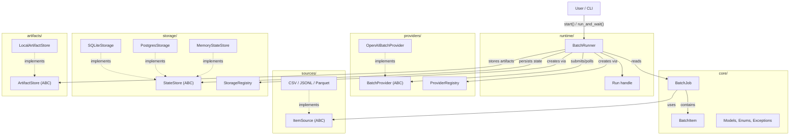
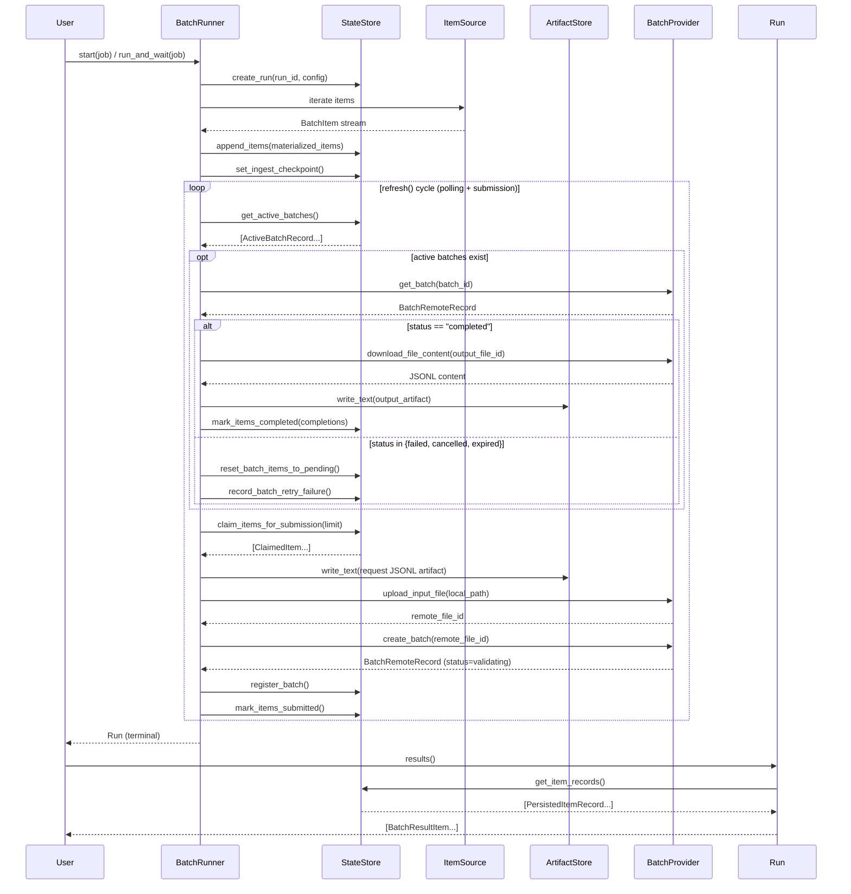
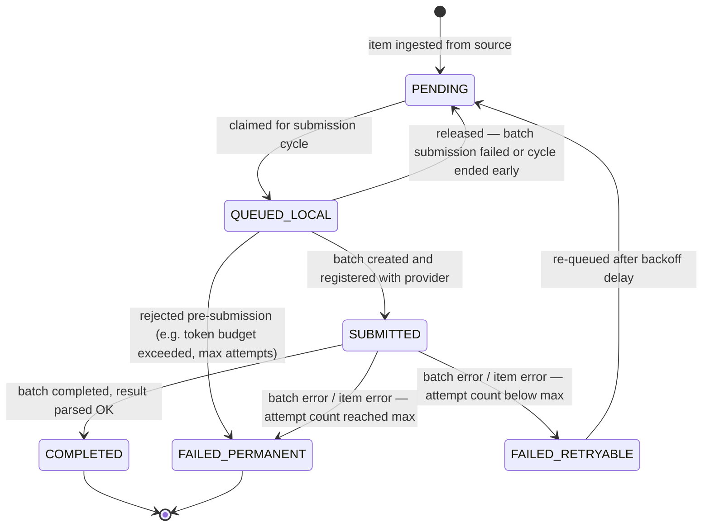
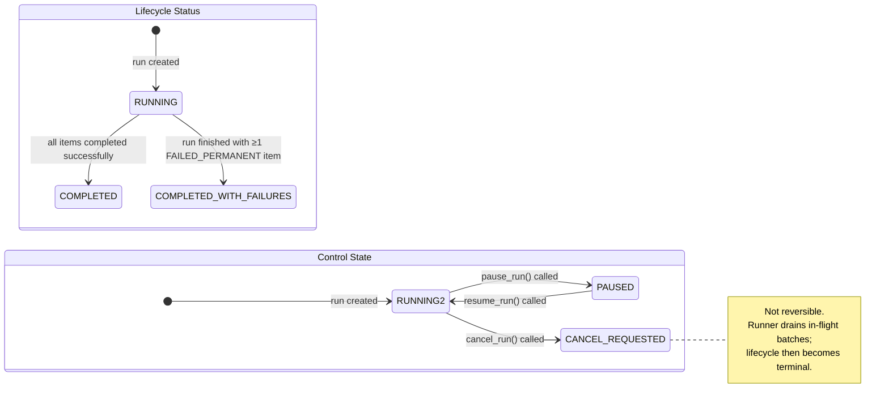

# Architecture

This document describes the current package shape and the main runtime boundaries in the implementation that ships today.

Status: reflects the current public-package implementation.

## Package shape

```text
batchor/
  .agents/
  docs/
  plugins/
  src/batchor/
    artifacts/
    cli.py
    core/
    providers/
    runtime/
    sources/
    storage/
  tests/
```

Repo-local contributor tooling also lives outside the shipped Python package:

- `.agents/skills/batchor-dev/` contains the repo skill for AI-agent onboarding
- `.agents/plugins/marketplace.json` registers repo-local plugins for Codex-style discovery
- `plugins/batchor-agent-tools/` contains the repo-local MCP server and plugin manifest

These directories are contributor tooling only and are not part of the published `src/batchor` package.

The package is organized around one core concern: durable batch execution. Most modules exist to support one of five responsibilities:

- domain models
- request/provider adaptation
- execution orchestration
- input streaming
- durable state and artifacts

## High-Level Architecture



This is the canonical diagram page for the current package shape. Keep the
README diagrams compact and reader-facing; put the detailed runtime and module
boundary view here.

## Core runtime concepts

The public runtime model centers on four types:

- `BatchItem`: one logical unit of work with stable `item_id`, application
  `payload`, and optional metadata.
- `BatchJob`: the declarative execution plan that bundles items or an
  `ItemSource`, prompt-building logic, provider config, and retry/artifact
  policy.
- `BatchRunner`: the orchestrator that resolves implementations, persists run
  state, builds or replays request artifacts, submits provider batches, polls
  remote status, and writes terminal results back into durable storage.
- `Run`: the durable handle returned by `start()` or `get_run()` for refresh,
  wait, pause/resume/cancel, terminal result reads, and artifact export/prune.

`CompositeItemSource` keeps the runner contract narrow: the runner still sees
one logical source, while callers remain responsible for selecting and ordering
the child sources up front.

## Main user-facing flow

The normal public flow is:

1. Construct a `BatchJob`.
2. Create a `BatchRunner`.
3. Call `start()` or `run_and_wait()`.
4. Work with the returned `Run`.

Internally that expands to:

1. Resolve provider and storage implementations.
2. Persist run config and ingest items into durable state.
3. Claim a bounded submission window from pending items.
4. Build or replay request JSONL rows.
5. Persist request artifacts before upload.
6. Submit one or more OpenAI batch files.
7. Poll active batches.
8. Download output/error files.
9. Parse terminal item results back into the state store.

## Execution Sequence



## Batch Lifecycle

### Item state machine

Each item in a run transitions through the following statuses:



### Run lifecycle

A run has two orthogonal state axes — **lifecycle status** (progress toward completion) and **control state** (operator signal).



Detailed storage, resume, and artifact-retention semantics live in
[`STORAGE_AND_RUNS.md`](STORAGE_AND_RUNS.md).

## Module boundaries

### `core/`

Owns domain types and public configuration models:

- `BatchItem`
- `BatchJob`
- `PromptParts`
- `RunSummary`
- `RunSnapshot`
- provider and storage enums
- provider config types such as `OpenAIProviderConfig`
- retry, chunk, artifact, and terminal-result models

`core/` should stay mostly declarative. It describes what a run is, not how the runtime executes it.

### `providers/`

Owns provider-facing abstractions and implementations:

- base provider contract
- provider registry
- OpenAI Batch implementation

The provider layer is responsible for:

- building provider request rows
- uploading input files
- creating batches
- polling batches
- downloading provider files
- normalizing provider output records

Durable artifact writing is not owned by the provider layer. The runner persists artifacts and hands staged local files to the provider.

### `runtime/`

Owns execution behavior:

- `BatchRunner`
- `Run`
- Typer CLI entrypoint for operator workflows
- persisted run control state with `pause`, `resume`, and drain-style `cancel`
- optional observer callback for provider lifecycle events
- token estimation and request chunking
- bounded pending-item claim windows before submission
- durable request-artifact replay for retry/resume
- per-refresh request-artifact file caching during replay
- artifact-store staging/export/delete orchestration
- incremental terminal-result paging/export for already-terminal items
- resumable deterministic-source checkpoints
- fresh-process recovery of `queued_local` items back to pending submission
- bounded concurrent provider polling and file download handling
- explicit terminal-run artifact pruning
- explicit raw-artifact export before raw-artifact pruning
- retry helpers
- response validation and structured-output parsing

This is where the durable lifecycle lives. It bridges the domain models, providers, storage, and artifact store.

### `sources/`

Owns streaming input adapters:

- `ItemSource`
- `CheckpointedItemSource`
- `CompositeItemSource`
- `CsvItemSource`
- `JsonlItemSource`
- `ParquetItemSource`

The built-in file sources support durable resume through a source fingerprint plus an ingest checkpoint stored in the control plane.
`CompositeItemSource` composes explicit checkpointed sources into one logical source without moving source discovery or partition ordering into the runner.

### `storage/`

Owns the durable and ephemeral state backends:

- `StateStore`
- SQLite implementation
- Postgres implementation
- in-memory implementation
- storage registry

The storage layer persists:

- run config
- run control state
- item state and attempts
- active batch metadata
- ingest checkpoints
- parsed terminal outputs
- terminal result sequence metadata
- pointers to durable artifacts

### `artifacts/`

Owns the payload plane for large durable files:

- request JSONL used for submission/replay
- raw output JSONL downloaded from the provider
- raw error JSONL downloaded from the provider

The built-in implementation is `LocalArtifactStore`.

### `cli.py`

Owns a deliberately narrow operator interface over the runtime:

- one or more explicit CSV and JSONL inputs only
- SQLite only
- JSON summaries
- explicit status, wait, results, export, and prune commands

The CLI is intentionally not the place where new orchestration behavior should be invented first.

## Why storage and artifacts are split

This is one of the most important design choices in the repo.

The state store holds indexed, queryable control-plane data.
The artifact store holds larger opaque files that must survive retry/resume/export workflows.

That split gives `batchor`:

- resumable request replay
- smaller durable control-plane rows
- clearer retention rules
- backend flexibility for future non-local artifact stores

## Current invariants

1. Public execution is run-oriented: `start()`, `get_run()`, `run_and_wait()`.
2. OpenAI Batch is the only built-in provider.
3. SQLite is the default durable backend.
4. Postgres is an opt-in durable backend for shared control-plane state.
5. Structured outputs require a module-level Pydantic v2 model for rehydration.
6. `Run.results()` is terminal-only.
7. `Run.refresh()` is explicit; summary properties do not implicitly hit the provider.
8. Durable artifacts flow through the `ArtifactStore` contract; the built-in implementation is `LocalArtifactStore`.
9. Stored item rows keep artifact keys, not absolute filesystem paths.
10. Fresh-process resume requeues `queued_local` items before attempting submission again.
11. `Run.prune_artifacts()` is explicit and terminal-only; it is not automatic garbage collection.
12. File-backed source resume requires a caller-supplied `run_id` plus a stable source fingerprint.
13. Raw output/error artifacts persist by default and require export before raw-artifact pruning.
14. A terminal run may be either `completed` or `completed_with_failures`; both statuses allow artifact export/prune and final result access.
15. Provider secrets may exist in in-memory config objects, but durable storage persists public provider config only.
16. CLI `.env` loading is a CLI-only convenience and not part of library runtime behavior.
17. Run lifecycle status and run control state are separate; pause/cancel do not redefine terminal lifecycle semantics.
18. Incremental terminal-result reads are sequence-based and only return items that have already reached a terminal item state.
19. Built-in deterministic-source resume currently covers CSV, JSONL, and Parquet; arbitrary iterables still do not become durable by magic.
20. `BatchItem.metadata["batchor_lineage"]` is reserved for lightweight source/join metadata when provided by built-in adapters or callers.

## Extension seams

The code is shaped for future providers and backends, but within explicit boundaries:

- provider config serialization goes through the provider registry
- storage creation goes through the storage registry
- runtime code works in terms of provider/store contracts instead of direct OpenAI/SQLite branches
- durable request replay is provider-agnostic at the runner/store boundary and materializes through the artifact-store contract
- deterministic-source resume uses source-specific checkpoints and currently supports the built-in CSV, JSONL, and Parquet sources
- provider observability hooks are callback-based and currently emit coarse lifecycle events from the runner

## Current gaps

- the only built-in provider is OpenAI Batch
- the only built-in artifact backend is local filesystem storage
- arbitrary non-checkpointable iterables do not support mid-ingest crash recovery
- the CLI does not expose the full Python API surface

## TBD

- multi-provider capability matrix doc
- remote/object-store artifact backend
- provider-side remote cancellation
